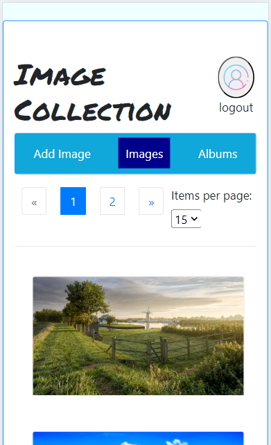

# Peter Cypers (202185333)

## <u>Project: Image Saving Application</u>

- [x] Front-end Web Development
  - <https://github.com/Web-IV/2324-frontendweb-PeterCypers>
  - <https://peter-cypers-images-project.onrender.com>
- [x] Web Services:
  - <https://github.com/Web-IV/2324-webservices-PeterCypers>
  - <https://peter-cypers-images-project.onrender.com>

**Logingegevens**

- E-mailadres: first.user@hotmail.com
- E-mailadres admin: sixth.admin@hotmail.com
- Wachtwoord: 12345678

Alle gebruikers hebben hetzelfde wachtwoord, de eerste 5 gebruikers volgen hetzelfde patroon voor login email. (first, second, ...)

De 2de gebruiker heeft al foto's en albums in zijn account. (second.user@hotmail.com)

## Projectbeschrijving

Met deze applicatie kunnen gebruikers zich registreren/aanmelden en foto's uploaden en bewaren, ze kunnen ook verzamelingen van foto's aanmaken en bijhouden. 

Uiteindelijk kunnen ze ook die verzamelingen beheren door ze van naam te veranderen, of verwijderen.

## Screenshots

  
  
  

## API calls

### Gebruikers

- `GET /api/users`: alle gebruikers ophalen
- `GET /api/users/:id`: gebruiker met een bepaald id ophalen
- `POST /api/users/login`: bestaande gebruiker aanmelden
- `POST /api/users/register`: nieuwe gebruiker registreren
- `PUT /api/users/:id`: bestaande gebruiker aanpassen op id
- `DELETE /api/users/:id`: bestaande gebruiker verwijderen op id

### Fotos

- `GET /api/fotos`: alle foto's(*) ophalen
- `GET /api/fotos/:id`: foto(*) ophalen op id
- `POST /api/fotos/save`: nieuwe foto(*) uploaden en persisteren op de back-end
- `DELETE /api/fotos/:id`: foto(*) verwijderen op id

### Albums

- `GET /api/albums`: alle albums(*) ophalen
- `GET /api/albums/:albumID`: album(*) ophalen op id
- `GET /api/albums/:albumID/images`: alle fotos van een album(*) ophalen op id
- `POST /api/albums`: nieuwe album(*) aanmaken
- `POST /api/albums/:albumID/:imageID`: voeg een foto toe aan een album(*)
- `POST /api/albums/create-and-add-photo`: combinatie van de bovenste 2 POST methodes
- `PUT /api/albums/:albumID`: album(*) aanpassen op id
- `DELETE /api/albums/:albumID`: album(*) verwijderen op id
- `DELETE /api/albums/:albumID/images/:imageID`: foto verwijderen uit een album(*)

(*): van de ingelogde gebruiker

## Behaalde minimumvereisten

### Front-end Web Development

- **componenten**

  - [x] heeft meerdere componenten - dom & slim (naast login/register)
  - [x] applicatie is voldoende complex
  - [x] definieert constanten (variabelen, functies en componenten) buiten de component
  - [x] minstens één form met meerdere velden met validatie (naast login/register)
  - [x] login systeem
 

- **routing**

  - [x] heeft minstens 2 pagina's (naast login/register)
  - [x] routes worden afgeschermd met authenticatie en autorisatie
 

- **state-management**

  - [x] meerdere API calls (naast login/register)
  - [x] degelijke foutmeldingen indien API-call faalt
  - [x] gebruikt useState enkel voor lokale state
  - [x] gebruikt gepast state management voor globale state - indien van toepassing
 

- **hooks**

  - [x] gebruikt de hooks op de juiste manier
 

- **varia**

  - [x] een aantal niet-triviale e2e testen
  - [x] minstens één extra technologie
  - [x] maakt gebruik van de laatste ES-features (async/await, object destructuring, spread operator...)
  - [x] duidelijke en volledige README.md
  - [x] volledig en tijdig ingediend dossier en voldoende commits

### Web Services

- **datalaag**

  - [x] voldoende complex (meer dan één tabel, 2 een-op-veel of veel-op-veel relaties)
  - [x] één module beheert de connectie + connectie wordt gesloten bij sluiten server
  - [x] heeft migraties - indien van toepassing
  - [x] heeft seeds
 

- **repositorylaag**

  - [x] definieert één repository per entiteit (niet voor tussentabellen) - indien van toepassing
  - [x] mapt OO-rijke data naar relationele tabellen en vice versa - indien van toepassing
 

- **servicelaag met een zekere complexiteit**

  - [x] bevat alle domeinlogica
  - [x] bevat geen SQL-queries of databank-gerelateerde code
 

- **REST-laag**

  - [x] meerdere routes met invoervalidatie
  - [x] degelijke foutboodschappen
  - [x] volgt de conventies van een RESTful API
  - [x] bevat geen domeinlogica
  - [x] geen API calls voor entiteiten die geen zin hebben zonder hun ouder (bvb tussentabellen)
  - [x] degelijke authorisatie/authenticatie op alle routes
 

- **algemeen**

  - [x] er is een minimum aan logging voorzien
  - [x] een aantal niet-triviale integratietesten (min. 1 controller >=80% coverage)
  - [x] minstens één extra technologie
  - [x] maakt gebruik van de laatste ES-features (async/await, object destructuring, spread operator...)
  - [x] duidelijke en volledige README.md
  - [x] volledig en tijdig ingediend dossier en voldoende commits

## Projectstructuur

### Front-end Web Development

## Mappen
- Public folder die static assets van de webpage bijhoudt.

## Components
- ZooKeeper architecture: components bij components, pages bij pages en contexts bij contexts.
- Component based structure(partial): enkel voor album-componenten, omdat er daar zoveel van zijn.

## Design patterns
- Composite pattern: AlbumList, FotoCardList
- Proxy: loaders als returns zijn een proxy voor de echte content die wacht op het afhandelen van data.
- Api layer abstraction.
- Route guard: private route component.
- Observer pattern: authcontext revalidatie afhankelijk van de user en de geldige token. Components die useAuth() gebruiken zijn observers.
- Atomic design: DeleteButton=Atom / EditButton=Molecule / Album=Organism / AlbumList=Organism / Albums=Template

Atom < Molecule < Organism < Template < Page

## State
- Er is een authcontext die over gans het project beschikbaar is met de context-api.

### Web Services

## Mappen
- Modulaire mappen structuur (seperation of concerns)

## Design patterns
- Seperation of concerns: rest/service/repository/etc
- Singleton: config/custom-environment-variables.js
- Error wrapping: _handleDBError.js
- Custom Error Object: serviceError.js
- Middleware pattern: bijna overal te zien, onder anderen: core/auth.js, core/validation.js, installMiddlewares.js

## Extra technologie

Werken met files zowel F-E als B-E is mijn extra technologie.

### <u>Keuze van package:</u>

Popularity:
[https://npmtrends.com/koa-body-vs-koa-bodyparser-vs-koa-multer-vs-multer](https://npmtrends.com/koa-body-vs-koa-bodyparser-vs-koa-multer-vs-multer)

Koajs(*):
[https://github.com/koajs/koa/wiki#body-parsing](https://github.com/koajs/koa/wiki#body-parsing)

Ik heb [koa-body(github)](https://github.com/koajs/koa-body) gekozen

Features (onder anderen):
- multipart/form-data
- file uploads

(*) De overwegende factor dat me heeft overtuigd om de koa-body package te gebruiken was dat ik multer niet terugvond op de koa webpage en dat koa-body als naam beter klinkt en ook dat die als eerste in de lijst van bodyparsers voorkwam.

### Front-end Web Development

File upload component:
[react-drag-drop-files](https://www.npmjs.com/package/react-drag-drop-files)

De gebruiker kan deze component aanspreken om files in te laden uit hun lokaal filesysteem, daarna kan je er vanalles mee doen, bvb doorsturen naar de back-end om op te slaan als het een image file is.

### Web Services

[koa-body(npm)](https://www.npmjs.com/package/koa-body)

Om files te versturen met http requests heb je iets extra nodig, [FormData](https://developer.mozilla.org/en-US/docs/Web/API/FormData) objecten zijn ingebouwde javascript objecten en kunnen omgaan met files, ze gedragen zich als een dictionary die key-value pairs krijgt die onder andere Strings/Blobs/Files/JSON/Formdata als key-value kunnen bevatten. Je hebt ook een parser nodig die de FormData object kan ontcijferen aan de back-end.

## Testresultaten

Zie de readme's voor het runnen van de tests.

### Front-end Web Development

Ik heb gekozen om per route tests te schrijven, ik heb enkel tests gemaakt voor de /fotos route. Een serieuze moeilijkheidsgraad komt erbij als ik ook de dropzone zou willen testen. Zie future expansions. Mits de tijd het zou toelaten zou ik alle hoofdroutes willen testen...Ik heb verschillende fouten teruggevonden door tests te schrijven, vele fouten zijn ook gesneuveld, sommige blijven bestaan.

In de front-end zijn het vooral error messages die wat blijven plakken, of niet op het scherm leesbaar zijn, normaal gezien niets ernstig, er zouden geen crashes moeten gebeuren.

### Web Services

Ik heb getest op het normaal verwachte verloop op elke endpoint en zoveel mogelijk verkeerde scenarios en alternative verlopen. Ook heb ik controles uitgevoerd op de correctheid van de returnvalues en status codes en/of errors.

## Gekende bugs

### Front-end Web Development

- Een error in login wordt ook getoond op register als je naar register gaat.
- Er is een bepaalde feedback msg (err|success) die soms niet te zien is bij nieuwe album aanmaken + foto toevoegen.
- Er is een success message feedback binnen het upload component die te vroeg verschijnt (ik heb die tevergeefs proberen overschrijven).
- Ik heb een static-assets folder moeten aanmaken dat de website favicon bijhoud omdat dit niet werd herkend als import uit de public folder. De import gebeurt in de index.html.

### Web Services

- Heb de endpoint van 'POST api/albums/save' niet voldoende kunnen testen. (Jest doet lastig met formdata)
- Het is mogelijk dat er geen barriëre voorzien is om een bepaalde gebruiker te weerhouden om een foto op id van een andere gebruiker aan zijn eigen album toe te voegen.

## Wat is er verbeterd/aangepast?

### Front-end Web Development

- Alles: Ik zat helemaal vast met het omgaan met files en bij het kiezen van de nodige package om met form-data om te gaan, dus ik had nog het merendeel van mijn project om af te werken.

- Enkel de drop-zone files component en de navigatie menu en routing naar de 3 pages bestonden, de rest is er allemaal bijgekomen.

- Verbeterde routing en afgeschermde routes.

### Web Services

- Alles: Ik zat lang vast, er was een minimum van voorziene endpoints en ik was volledig verkeerd bezig op de api calls op de endpoints. En wist niet hoe ik moest omgaan met de ontvangen files van de front-end.

- Alle api calls die de userId mee kregen zijn herwerkt om die id anders te verkrijgen.
- Heb een andere bodyparser geïntroduceerd die ik nodig heb om met multipart formdata om te gaan.
- De gevoelige user data afgeschermd en environments verbeterd.
- Business logic zo veel mogelijk uit de rest laag gehaald.
- Een volledig systeem om files lokaal(op de back-end server) te saven/deleten en te serven geïntroduceerd.

## Mogelijke toekomstige uitbreidingen/interesses

### Front-end Web Development

- Optimization door het tegenhouden van onnodige re-renders.

- Sorting/Filtering van de images.

- Andere style framework/component UI uitproberen: Tailwind.

- Verschillende soorten popups(components) gebruiken.

- Meerdere files tegelijk proberen behandelen.

### Web Services

- Prisma ORM tool onderzoeken en leren gebruiken.

### Algemeen

- Image naam ook opnemen in de databank zodat ik daar iets op de front end mee kan doen (bvb een img title, rename, etc.).

- Testen leren maken met formdata objecten. (FE+BE)

- Linting onderzoeken.

- Typescript leren gebruiken.
